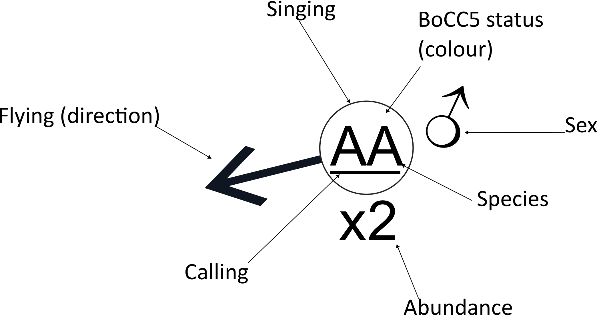

  

# QGIS BTO Bird Survey project

  

This project is for digitising BTO bird surveys, like individual breeding bird surveys.

The form when you add a record allows you to set:

  

* Species (By BTO code, but it lists the species name)

* Species sex - male, female, pair, or unknown

* If it is in song

* If it is calling

* If it is flying (and the direction, handy little spin wheel to choose the direction, it's not precise, so you may need to play with it)

* Abundance

* Date

  

And then in the metadata, there various other things recorded:

* BoCC5 status

* Whether it is a Section 41 species

* If it is a UKBAP priority species

* Whether it is Annex 1 of the birds directive

* Whether it is Schedule 1 species

  

* Any further comments

* And an auto-filling box of author, and the created/updated dates for data record keeping.

### Legend

This is a potential legend you can use in QGIS print composer for the style.

### Attributions
This project uses data from NBN Atlas.
* Ratcliffe, S. 2022, [Biodiversity Action Plan UK list of priority species](https://registry.nbnatlas.org/public/show/dr583 "view Data Resource page")
* Stringer, A. 2019 [s41 Priority species list](https://registry.nbnatlas.org/public/show/dr2017 "view Data Resource page")
* Stroud, R. 2020, [Wildlife and Countryside Act 1981 - Schedule 1 Part 1](https://registry.nbnatlas.org/public/show/dr560 "view Data Resource page")
* Stroud, R. 2020, ## [Wildlife and Countryside Act 1981 - Schedule 1 Part 2](https://registry.nbnatlas.org/public/show/dr561 "view Data Resource page")
* A.J., Eaton, M.A., Aebischer, N.J., Balmer, D., Brown, A.F., Douse, A., Lindley, P., McCulloch, N., Noble, D.G. & Win, I. December 2021 . British Birds Volume: 114,  [The fifth Birds of Conservation Concern in the United Kingdom, Channel Islands and Isle of Man (BoCC5) December 2021](https://registry.nbnatlas.org/public/show/dr2635 "view Data Resource page")
* Stroud, R. 2020 [Birds Directive - Annex 1](https://registry.nbnatlas.org/public/show/dr523 "view Data Resource page")
* BTO, Bird codes [Codes and survey instructions available here](https://www.bto.org/our-science/projects/bbs/taking-part/download-forms-instructions)
